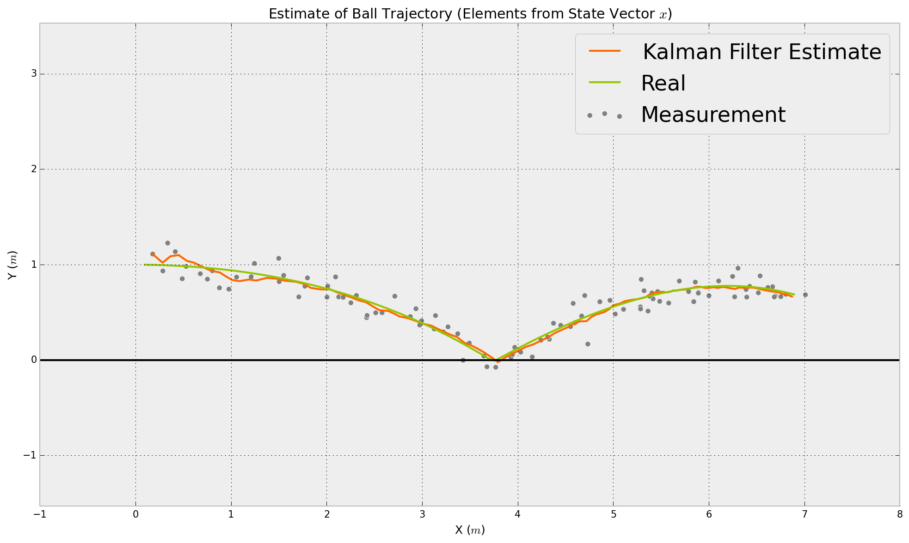

Multidimensional Kalman-Filter
==============================
Some Python Implementations of the Kalman Filter
------------------------------

####See [Vimeo](https://vimeo.com/album/2754700/sort:preset/format:detail) for some Explanations.

### Kalman Filter with Constant Velocity Model

Situation covered: You drive with your car in a tunnel and the GPS signal is lost. Now the car has to determine, where it is in the tunnel. The only information it has, is the velocity in driving direction. The x and y component of the velocity (x˙ and y˙) can be calculated from the absolute velocity (revolutions of the wheels) and the heading of the vehicle (yaw rate sensor).

[View IPython Notebook](http://nbviewer.ipython.org/github/balzer82/Kalman/blob/master/Kalman-Filter-CV.ipynb?create=1) ~ [See Vimeo](https://vimeo.com/87854542)

### Kalman Filter with Constant Acceleration Model

#### in 2D

Situation covered: You have an acceleration sensor (in 2D: $\ddot x¨ and y¨) and try to calculate velocity (x˙ and y˙) as well as position (x and y) of a person holding a smartphone in his/her hand.

[View IPython Notebook](http://nbviewer.ipython.org/github/balzer82/Kalman/blob/master/Kalman-Filter-CA.ipynb?create=1) ~ [See Vimeo](https://vimeo.com/87854541)

Second example is the same dynamic model but this time you measure the position as well as the acceleration. Both values have to be fused together with the Kalman Filter.
Situation covered: You have an acceleration sensor (in 2D: x¨ and y¨) and a Position Sensor (e.g. GPS) and try to calculate velocity (x˙ and y˙) as well as position (x and y) of a person holding a smartphone in his/her hand.

[View IPython Notebook](http://nbviewer.ipython.org/github/balzer82/Kalman/blob/master/Kalman-Filter-CA-2.ipynb?create=1) ~ [See Vimeo](https://vimeo.com/87854540)

#### in 3D

Third example is in 3D space, so the state vector is 9D. This model is for ball tracking or something else in 3D space.

[View IPython Notebook](http://nbviewer.ipython.org/github/balzer82/Kalman/blob/master/Kalman-Filter-CA-Ball.ipynb?create=1)

### Adaptive Kalman Filter with Constant Velocity Model

Here the Measurement Covariance Matrix R is calculated dynamically via the maximum likelihood of the acutal standard deviation of the last measurements.

[View IPython Notebook](http://nbviewer.ipython.org/github/balzer82/Kalman/blob/master/Adaptive-Kalman-Filter-CV.ipynb?create=1)

## Extended Kalman Filter

### Extended Kalman Filter with Constant Turn Rate and Velocity (CTRV) Model

Situation covered: You have an velocity sensor which measures the vehicle speed (v) in heading direction (ψ) and a yaw rate sensor (ψ˙) which both have to fused with the position (x & y) from a GPS sensor.

[View IPython Notebook](http://nbviewer.ipython.org/github/balzer82/Kalman/blob/master/Extended-Kalman-Filter-CTRV.ipynb?create=1) ~ [See Vimeo](https://vimeo.com/88057157)

## License

`CC-BY-SA2.0 Lizenz`
